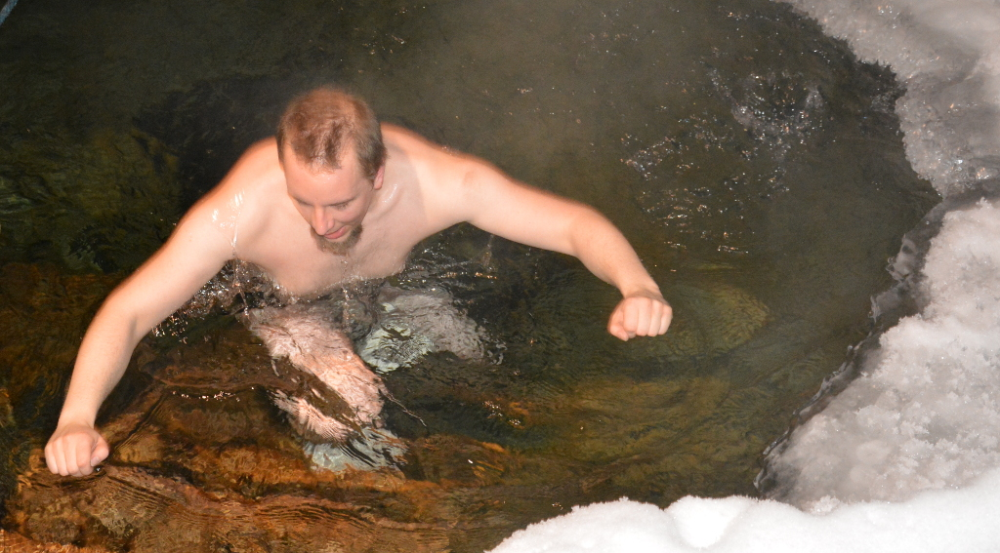

# Conferences you did not know existed and now you know you just need to go to.

---

# [nucl.ai](http://nucl.ai/)

## what: artificial intelligence

Note: ever fascinated by Conway's game of life ?

---

# [nucl.ai](http://nucl.ai/)
## why: eat Wiener Schnitzel with The Witcher devs in Vienna
Note: it's the clash between industry veterans and pure theory what makes it interesting  
you can see the cycles of academia feeding industry and vice-versa  
Petra and Alex - super cool people  

---

# [Erlang Factory: EUC](http://www.erlang-factory.com/)

## what: functional programming
Note: EUC = Erlang User Conference
with FP being all the rage now, this is one of the best FP conferences in Europe
as with all good conferences it's not all about one thing, i.e. it's not all about Erlang in this case. Lots of distributed systems things

---

# [Erlang Factory: EUC](http://www.erlang-factory.com/)

## why: meet Joe Armstrong, 
## visit Stockholm
Note: swedish table, very cool to visit Ericsson's offices - some of the workshops were there

---

# [SoCraTes](https://www.socrates-conference.de/)
## What: software craftsmanship and testing
Note: a whole family of conferences spanning Europe

---

# [SoCraTes](https://www.socrates-conference.de/)
## Why: intimate, encourages active participation
Note: was quite cool for me as forced me to prepare different activities for different kind of people. marketplace of ideas

---

# [CCC](https://en.wikipedia.org/wiki/Chaos_Communication_Congress)
## What: CCC is beautiful and strange
Note: a conglomerate of different tracks and ideas. history of CCC. more research, less money. everyone's equal. lots of strange and friendly people.

---

# [CCC](https://en.wikipedia.org/wiki/Chaos_Communication_Congress)
## Why: the most intense 4 days of the year
Note: remember Neo downloading kung-fu ? club mate - the legend goes that it was needed by German hackers. tracks, workshops, lockpicking, politics, meeting people. no room - no problem - streaming. meet RMS

---

# [The Dutch Camp & CCC (camp)]()
## what: CCC outdoors
Note: a tent, 10gbps connection, a middle of the forest

---

# [The Dutch Camp & CCC (camp)]()
## Why: be close to the nature and the people
Note: test your outdoor skills and tech, like solar powered stuff

---

# go and explore
## plan your next conference now. bonus points for speaking there
Note: talk to people. tech conferences allow you to start talking to strangers more easily - i.e. what's your project about ?

---

> That is a very good question, but now I need to go over there...

---

# further reading
[CCC - a very German conference](http://motherboard.vice.com/read/chaos-communication-congress-a-very-german-hacking-conference)  
[Sarah Sharp on conferences](http://sarah.thesharps.us/2016/02/02/first-timers-guide-to-foss-conferences/)

