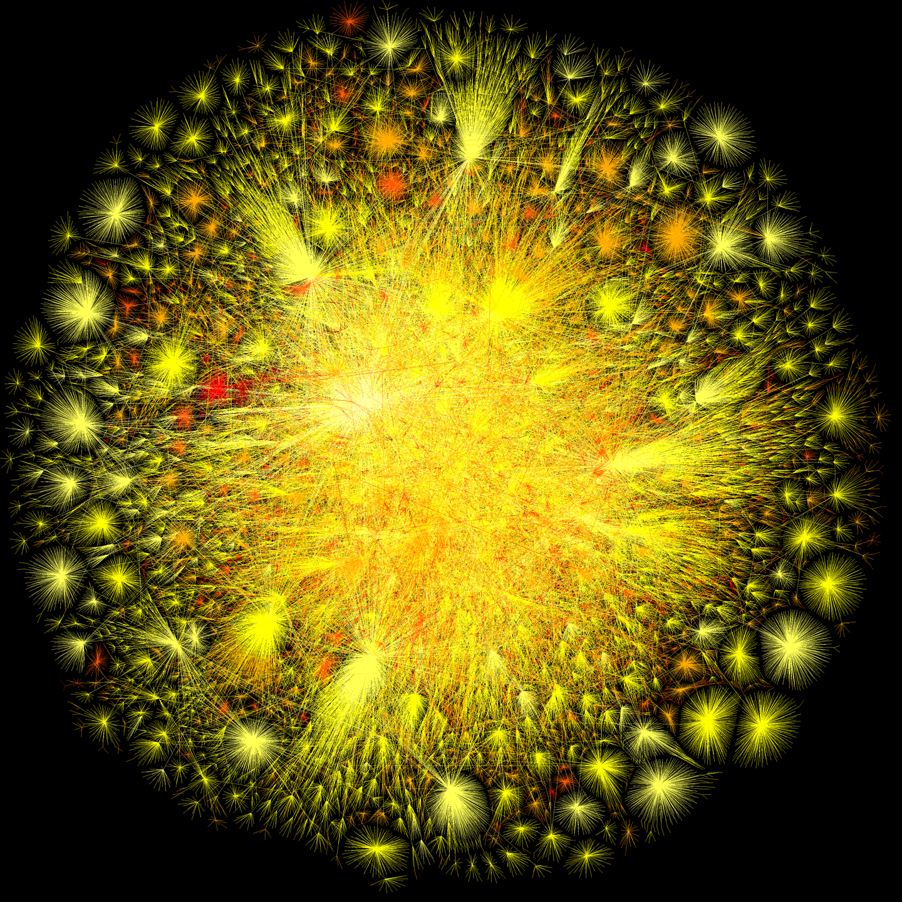
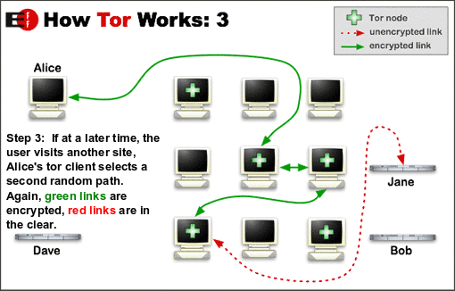

## Dangers of the internet. 
## Suddenly - Tor.
> by Cyryl Płotnicki-Chudyk

Note:
thanks to organizers  
was invited, discovered that to give a talk about Tor you need to first have a chat about the internet  
Q&A at the end of the 'intro to internet' section and at the end of the talk  

---

## Internet: how does it work ?

---

## Display a page over HTTP

1. browser --domain--> DNS 
2. DNS --IP--> browser
3. browser --can I haz a page ?--> server at IP
4. server --page--> browser  

Note:
mention 'decentralization' of the DNS

---

## Choosing your path on the internet

* most commonly fastest  
* not necessarily shortest  
* governed by an ancient protocol  

Note:
give an example of re-routing lost of traffic 'accidentally'

---

## Danger !  

Note:
quiz for the audience: what's wrong with the above  
go for snooping and or MITM with answers, delay the rest  

---

## Introducing HTTPS

* 'prove' the authenticity of the server
* encrypt the channel

Note:
ask if anyone has an idea on how the 'proof' can be achieved

---

## PKI infrastructure

Note: 
anecdotes about PKI centralized model failures

---

## How does internet work - a summary
* each computer on the internet has an IP address
* DNS resolves human readable names to IP addresses
* HTTPS allows for encrypted communication
* HTTPS means some identity proofs

Note:
DNS  
PKI  
data at rest vs data in transit -   
transferring your home address over encrypted channel  
IP = home address nevertheless  
with HTTPS Eve might not know the content but knows about the pages you visit anyway

---

# Q-s and some A-s

---

# Tor

Note:
remind of a segway: your IP is valuable, Eve might get your home address

---

## Tor  
helps with IP-level problems

Note: 
ask audience to come up with their solutions  
if someone knows how this works already - please remain silent for now

---

## Tor - how does it work ?

Note: 

---

---

---

---

> Tor is free software and an open network that helps you defend against traffic analysis, a form of network surveillance that threatens personal freedom and privacy, confidential business activities and relationships, and state security.

---

## ok, ok, how do I use it ?

---

# Q&A

---

# Workshops:
> tor@cyplo.net

---

### More info:

* www.torproject.org
* en.wikipedia.org/wiki/History_of_the_Internet
* web.stanford.edu/class/msande91si/www-spr04/readings/week1/InternetWhitepaper.htm
* panoptykon.org
* blog.cyplo.net/about/

